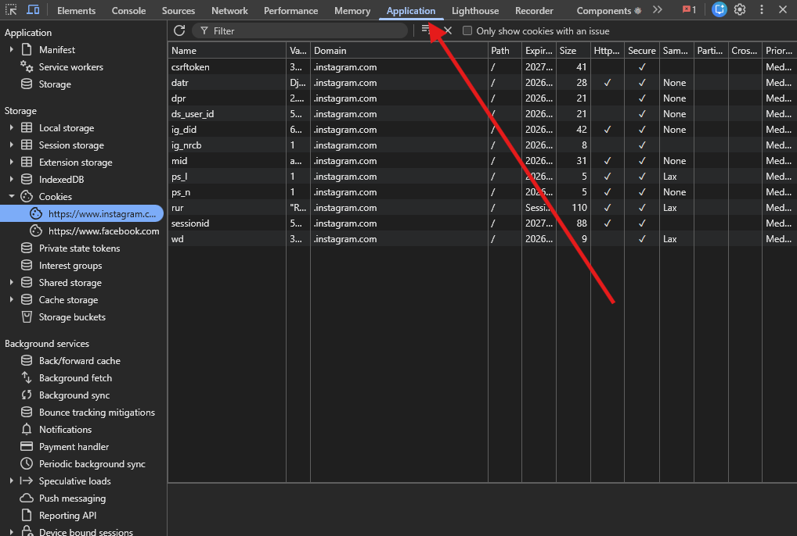
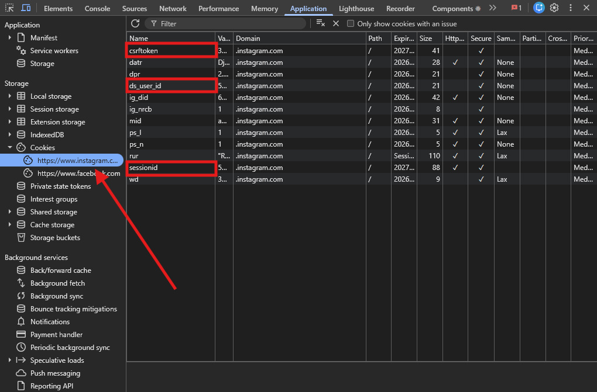

# Scorify — Influencer Intelligence Platform

Scorify is a full-stack web application that lets brands evaluate Instagram influencers before committing to a campaign. You enter a brand campaign brief, pick an influencer, and the app fetches their profile, posts, comments, and followers — then runs a machine learning model to produce a match score, a followers credibility score, and a fans content engagement score.

---

## Repository Structure

```
scorify/
├── src/                        # React frontend (TypeScript)
│   ├── App.tsx                 # Landing page + routing
│   ├── Dashboard.tsx           # Main analysis dashboard
│   ├── index.css               # Global styles (Tailwind)
│   └── main.tsx                # React entry point
│
├── hack-main/                  # ML scoring engine
│   ├── model.joblib            # Trained scikit-learn pipeline (saved with v1.6.1)
│   ├── score.py                # FastAPI server exposing /predict endpoint
│   └── predict_once.py         # CLI wrapper — reads JSON from stdin, prints score to stdout
│
├── public/                     # AI prompt instructions (read by server at runtime)
│   ├── followers_credibility.md   # Prompt for Gemini follower scoring
│   ├── post_analysis.md           # Prompt for Gemini post content analysis
│   └── post_engagement_score.md   # Prompt for Gemini engagement scoring
│
├── server.ts                   # Express backend + Vite dev middleware
├── index.html                  # HTML shell
├── package.json
├── tsconfig.json
├── vite.config.ts
├── .env.example                # Environment variable template
├── SCORES.md                   # Full scoring system reference documentation
└── README.md                   # This file
```

---

## What the App Does

### Landing Page (`/`)
- User types an Instagram username into the search bar
- The app queries Instagram's search API via Playwright headless browser to show matching accounts in a dropdown
- User selects an influencer — the form does **not** navigate yet
- A campaign setup form slides in below the search bar asking for:
  - Product Category (Beauty, Fashion, Tech, Food, Travel, Fitness, Gaming, Finance, Home, Education)
  - Campaign Goal (Awareness, Conversion, Engagement, Retention)
  - Brand Positioning (Luxury, Premium, Mass Market, Budget)
  - Product Price
  - Brand Description (free text describing the brand and target audience)
- Once the form is filled, clicking **Analyze Influencer** navigates to the dashboard

### Dashboard (`/dashboard/:username`)
The dashboard has two tabs: **Account** and **Data**.

**Account tab** shows the influencer's Instagram profile — profile picture, bio, follower/following/post counts, verified badge, and a grid of their latest posts. Clicking a post opens a modal with the full image or video, caption, and comments.

**Data tab** shows all computed scores and analytics. Everything runs automatically on page load in this sequence:

1. **Fetching user profile** — Apify scrapes the Instagram profile and latest 10 posts
2. **Fetching comments** — Apify scrapes up to 15 comments per post
3. **Fetching followers** — Apify scrapes 100 followers
4. **Calculating analytics** — engagement rate, avg likes/comments, variance, comment rate (computed locally from the fetched data)
5. **Scoring match** — the ML model in `hack-main` runs and produces the influencer × brand match score
6. **Scoring fans content engagement** — Gemini AI analyzes each post's media and compares it against actual comments to score engagement quality

The left panel shows a live step-by-step progress indicator for all of the above, plus a compact card showing the active campaign info.

---

## Scores Produced

| Score | What it measures | Range |
|---|---|---|
| **Influencer Match** | How well the influencer fits the brand, campaign goal, and audience | 0–100 |
| **Fans Content Engagement** | How genuine and relevant the audience comments are per post | 0–100 |
| **Engagement Rate** | (likes + comments) / followers across last 10 posts | % |
| **Avg Engagement Per Post** | Average total interactions per post | count |
| **Avg Likes Per Post** | Average likes per post + std dev | count |
| **Avg Comments Per Post** | Average comments per post | count |
| **Avg Comment Rate (View-Based)** | Comments / views for video posts only | % |

See `SCORES.md` for full threshold tables, badge labels, and color codes.

---

## Prerequisites

### Node.js
Version 18 or higher. Download from [nodejs.org](https://nodejs.org).

### Python
Version 3.10–3.13. Download from [python.org](https://python.org).

**Required Python packages — must install scikit-learn exactly 1.6.1 to match the saved model:**
```bash
pip install scikit-learn==1.6.1 numpy pandas joblib
```

> If you have a newer scikit-learn already installed, the downgrade is required. The model was serialized with 1.6.1 and will fail to load on 1.7+.

### Playwright browsers
```bash
npx playwright install chromium
```

---

## Setup

### 1. Clone the repo
```bash
git clone https://github.com/raed-j3mli/scorify.git
cd scorify
```

### 2. Install Node dependencies
```bash
npm install
```

### 3. Configure environment variables
Copy the example file and fill in your keys:
```bash
cp .env.example .env
```

Open `.env` and set the following:

```env
# Required for Fans Content Engagement scoring
# You can add multiple keys separated by commas for rotation
GEMINI_API_KEY=your_gemini_api_key_here

# Required for fetching Instagram data (profile, posts, comments, followers)
APIFY_API_TOKEN=your_apify_token_here

# Instagram session cookies — required for the username search on the landing page
# Get these from your browser's DevTools after logging into Instagram
IG_SESSIONID=your_session_id
IG_DS_USER_ID=your_ds_user_id
IG_CSRFTOKEN=your_csrf_token

# Set to TRUE to use mock data without real API calls (for local testing)
USE_MOCK_DATA=FALSE
```

#### How to get each key

**GEMINI_API_KEY**
Go to [aistudio.google.com](https://aistudio.google.com), sign in, and create an API key under "Get API key".

**APIFY_API_TOKEN**
Sign up at [apify.com](https://apify.com), go to Settings → Integrations, and copy your API token. The app uses three Apify actors:
-  Instagram profile scraper
-  Instagram comments scraper
-  Instagram followers scraper

**Instagram session cookies**
1. Open Chrome and log into [instagram.com](https://instagram.com)
2. Open DevTools — press `F12` or right-click anywhere on the page and click **Inspect**
3. Click the **Application** tab at the top of DevTools

   

4. In the left sidebar, expand **Cookies** and click on `https://www.instagram.com`
5. Find and copy the values for `sessionid`, `ds_user_id`, and `csrftoken`

   

---

## Running Locally

```bash
npm run dev
```

This starts the Express server with Vite dev middleware on **http://localhost:3000**.

The server also runs a warm-up call to the ML model on startup so the first real request is fast.

### Mock mode (no API keys needed)
Set `USE_MOCK_DATA=TRUE` in your `.env` file, then use the username `xx` on the landing page. This bypasses all Apify and Instagram calls and uses pre-built mock data for a fake lifestyle creator with 154k followers.

---

## How the ML Model Works

The model lives in `hack-main/` and is a scikit-learn pipeline saved as `model.joblib`. It was trained to predict how well an influencer matches a brand campaign.

**Input:** 41 numerical features + 4 categorical features (product category, campaign goal, brand positioning, influencer category).

**The server computes all features automatically** from the fetched Instagram data and the brand form you filled in:

| Feature group | Source |
|---|---|
| Engagement metrics | Computed from the influencer's last 10 posts |
| Follower quality signals | Computed from the 100 fetched followers (username randomness, profile completeness, bot probability) |
| Comment quality signals | Computed from fetched comments (sentiment, duplicates, active ratio) |
| Posting cadence | Computed from post timestamps |
| Fit scores | Computed by comparing brand form input against influencer content |

**Fit scores** are the most impactful inputs to the model:

- `category_match_score` — keyword overlap between the influencer's bio/captions and the selected product category
- `price_fit_score` — whether the product price fits the brand positioning tier
- `audience_product_fit` — word overlap between the brand description and the influencer's content
- `brand_fit_score` — luxury/budget signal words in the influencer's content vs brand positioning
- `engagement_weight_context` — scales based on campaign goal × actual engagement rate

The model runs via `predict_once.py` which is spawned as a subprocess by the Node server. It reads features as JSON from stdin and prints `{"match_score": 0.xxxx}` to stdout.

**Match score labels:**

| Score | Label |
|---|---|
| 80–100 | Excellent match |
| 65–79 | Good match |
| 50–64 | Moderate match |
| 0–49 | Poor match |

---

## Project Tech Stack

| Layer | Technology |
|---|---|
| Frontend | React 19, TypeScript, Tailwind CSS v4, Framer Motion, Recharts |
| Backend | Node.js, Express, TypeScript, tsx (dev runner) |
| Bundler | Vite 6 |
| ML model | Python, scikit-learn 1.6.1, pandas, numpy, joblib |
| AI scoring | Google Gemini API (`@google/genai`) |
| Instagram data | Apify cloud actors |
| Headless browser | Playwright (Chromium) — used for Instagram search |

---

## File Reference

| File | Purpose |
|---|---|
| `server.ts` | All backend logic: Express routes, Apify calls, Gemini calls, feature computation, ML model subprocess |
| `src/App.tsx` | Landing page with username search and campaign setup form |
| `src/Dashboard.tsx` | Full analysis dashboard with all score cards, analytics, and post grid |
| `hack-main/predict_once.py` | Reads features from stdin, loads model, prints match score to stdout |
| `hack-main/score.py` | FastAPI server version of the model (alternative interface, not used by the app directly) |
| `public/post_analysis.md` | System prompt telling Gemini how to analyze a post's content and tone |
| `public/post_engagement_score.md` | System prompt telling Gemini how to score comment quality against post content |
| `public/followers_credibility.md` | Legacy Gemini prompt for follower scoring (replaced by ML model) |
| `SCORES.md` | Full scoring reference — all thresholds, labels, colors, and formulas |
